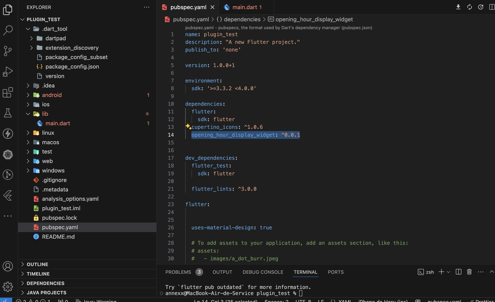
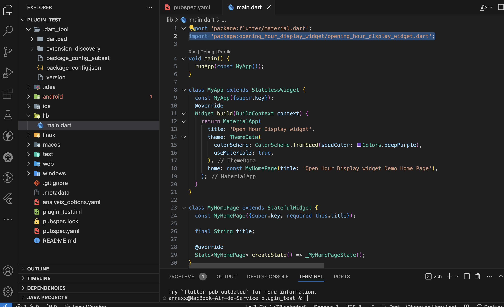
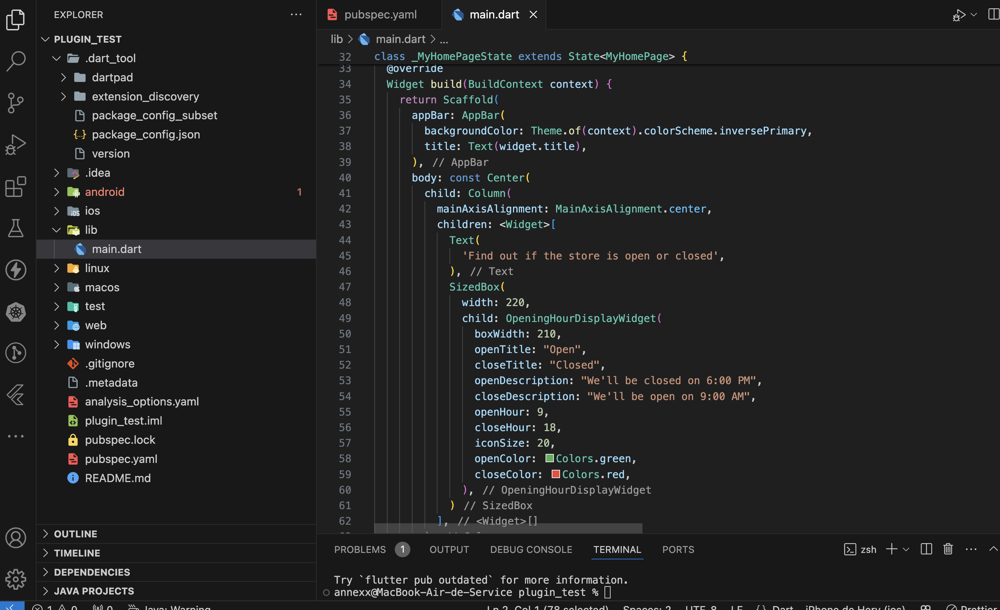

# opening_hour_display_widget

A Flutter plugin to display opening hours of a business, with a customizable design: From the front-size to
the back-ground color, you can customize everything.The widget retrieves the system time from the mobile terminal to display the appropriate message

## Installation

Run this command on a terminal at the root of your project:

```
flutter pub add opening_hour_display_widget
```

## Customizable options :

String openTitle,
String closeTitle,
String openDescription,
String closeDescription,
Color openColor (Text color if open),
Color closeColor (Text color if closed),
double boxWidth (Wdith of the widget),
double iconSize (Width of the clock Icon),
double textSize,
int openHour (define in int the open Hour),
int closeHour (define in int the closed Hour),
Color openHourBackgroundColor,
Color closeHourBackgroundColor,

## Example

After running the command below, you should see this in your pubspec.yaml :



To use it, you must first import the package



And finally, to use it, you can do this way :



This is a screenshot of the excpected result :


